## Результаты:

### 1. Реализация кастомного LogMelFilterBanks

Реализован класс `LogMelFilterBanks(nn.Module)`, который последовательно считает STFT с окном Ханна, берёт степенной спектр, умножает на мелфильтр банки и применяет логарифм.

**Мелфильтр банки (80 фильтров):**

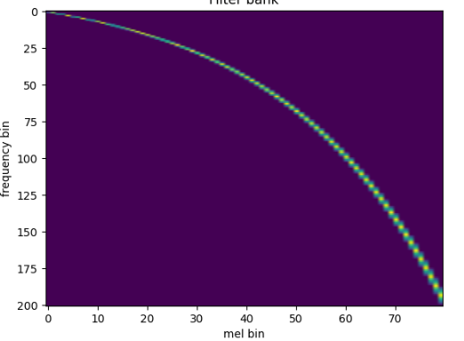

**Мелспектрограмма сигнала (без log):**

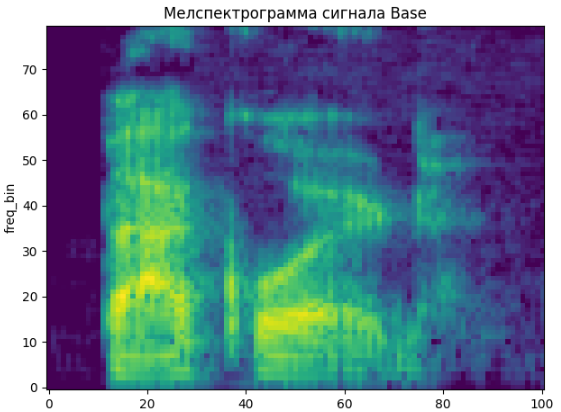

**Сравнение LogMelFilterBanks vs torchaudio + log:**

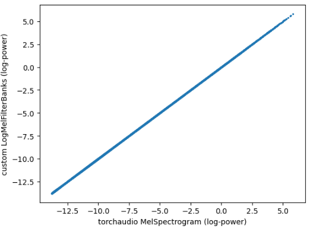

Выход кастомной реализации совпадает с `torchaudio` + log - точки лежат строго на диагонали, allclose проходит.

### 2. Обучение модели классификации

Реализована модель MelNet на Conv1d свёртках:

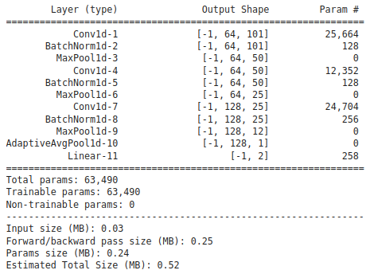

Число параметров (n_mels=80, groups=1): **~63 490**

Обучение: PyTorch Lightning, 40 эпох, Adam lr=1e-3, ReduceLROnPlateau.

### 3. Эксперименты с n_mels [20, 40, 80]

**Train loss:**

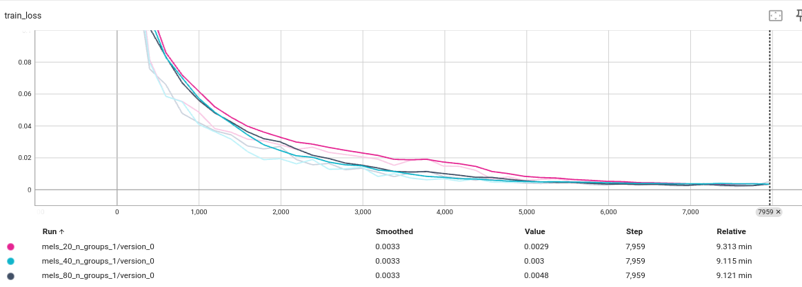

**Train accuracy:**

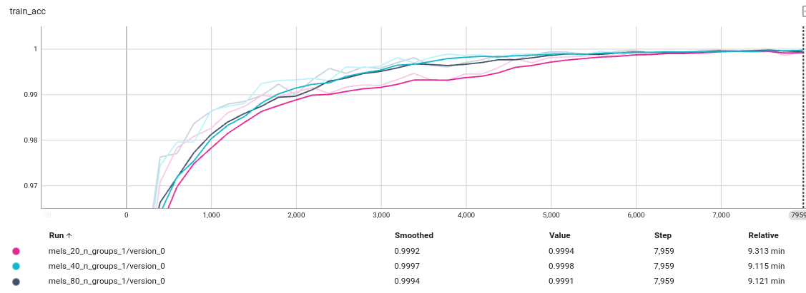

**Validation loss:**

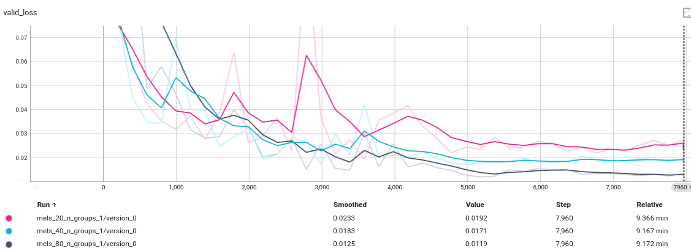

**Validation accuracy:**

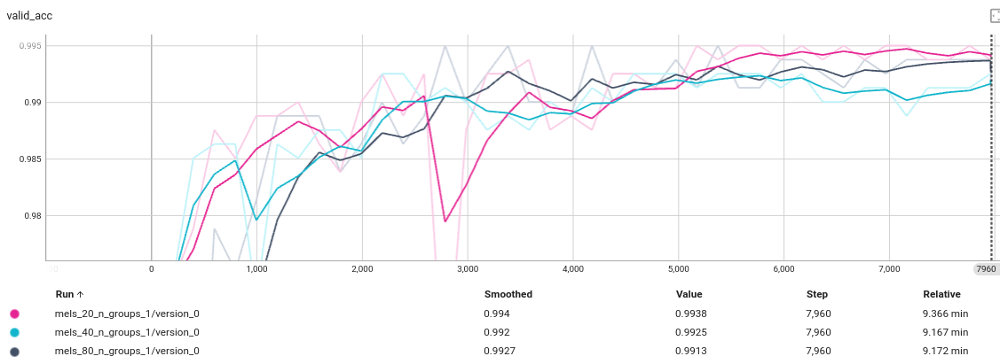

**Тестовые метрики (n_mels=80):**

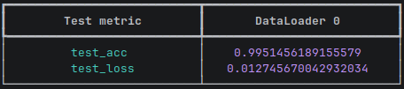

Модель с n_mels=20 показала лучшую valid_acc, хотя train loss немного выше, больше фильтров даёт чуть хуже обобщение на текущей задаче ввозможно это связано с какими-то выбросами в определенном спектре сигнала (шум), которые сглаживаются при усреднении на меньшем количестве бинов. Хотя различия не значительные между результатами  и возможно в целом для такой простой задачи классификации  количество фильтров больше 20 просто избыточно.

Итоговая точность на тестовой подвыборке (n_mels=80): **99.51%**

---

### 4. Эксперименты с параметром groups в Conv1d

**Train loss:**

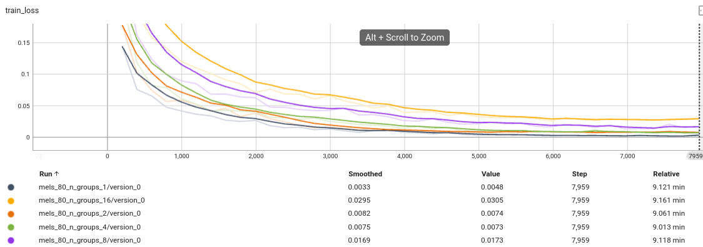

**Train accuracy:**

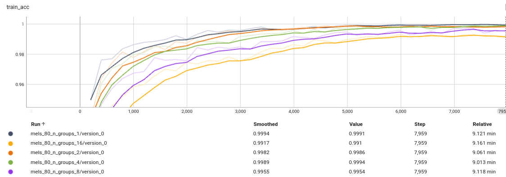

**Validation loss:**

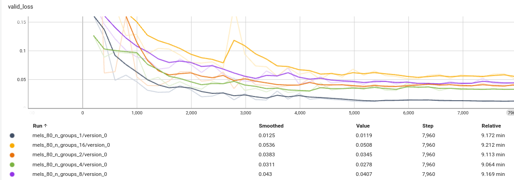

**Validation accuracy:**

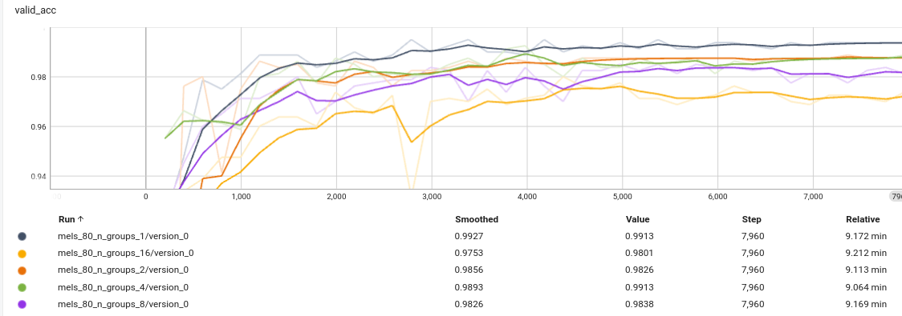

**Время эпох и параметры модели:**

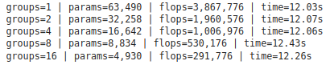

На основе проведённых экспериментов можно сделать вывод, что увеличение числа групп ухудшает качество модели: при groups=1 получаем val accuracy 0.993, а при groups=16 - 0.975. При этом количество параметров падает примерно в 13 раз (с 63 490 до 4 930), FLOPs-также примерно в 13 раз (с 3 867 776 до 291 776). Время на 1 эпоху остаётся практически неизменным при разных значениях groups - это объясняется тем, что модель достаточно мала, и основные затраты времени приходятся на подготовку и загрузку данных на GPU. Вычисления на модели размером 8-63к параметров занимают незначительное время по сравнению с IO.